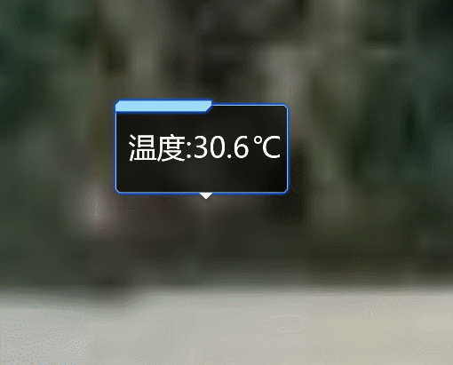

**BillboardPlane类说明**
==============================
>### 功能：  
> 添加标签
>
  
### 接口
- 实例化
```javascript
let billboardPlane = new BillboardPlane(viewer,[longitude, latitude, height],text)
```
参数说明：  
>- **viewer 主视图**
>- **[ longitude, latitude, height ] 添加点的位置经纬度和高程**
>- **text 即将显示的温度**
  
- 聚焦
```javascript
billboardPlane.flyTo()
```
- 更新
```javascript
alertMarker.updateText(text)
```
- 销毁(TODO暂时未能实现)
```javascript
alertMarker.remove()
```