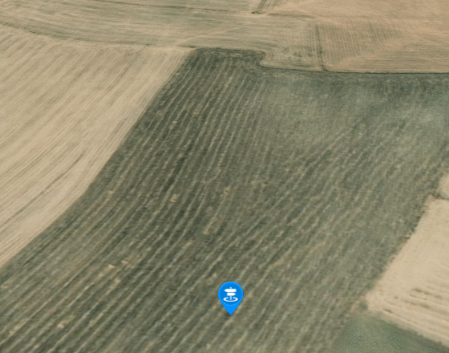

**BounceMarker类说明**
==============================
>### 功能：  
> 添加弹跳点功能
>
  
### 接口
- 实例化
```javascript
let bouncemarker = new BounceMarker(viewer,[longitude,latitude,height],style={}) 
```
参数说明：  
>- viewer 主视图
>- [longitude, latitude, height] 添加点的位置经纬度和高程
>- style 可选，配置弹跳参数(image、bounceHeight、increment)
```javascript
style = {
  image: "./image/billboard.png", //图标
  bounceHeight: 100, //高度
  increment: 0.05, //增量
};
```
- 聚焦
```javascript
bouncemarker.flyTo()
```
- 弹跳
```javascript
bouncemarker.bounce()
```
- 销毁
```javascript
bouncemarker.destroy()
```
