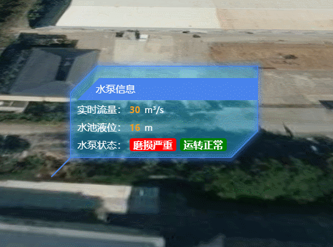

**DivPoint类说明**
==============================
>### 功能：  
> 添加科技感标签  (标签内容都写死在类内，不完善，可自行修改)
>
  
### 接口
- 实例化
```javascript
let divPoint = new DivPoint(viewer,[longitude,latitude,height],{title:"水泵信息",flow:30,stage:16,status:[{label:"磨损严重",state:0},{label:"运转正常",state:1}]})
```
- 聚焦
```javascript
divPoint.flyTo()
```