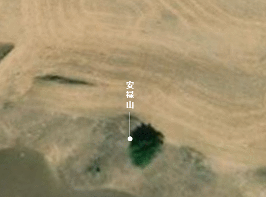

**ErectLable类说明**
==============================
>### 功能：  
> 竖版标签
>
  
### 接口
- 实例化
```javascript
let erectLable = new ErectLable(viewer,[longitude, latitude, height],label)
```
参数说明：  
>- **viewer 主视图**
>- **[longitude, latitude, height] 添加点的位置经纬度和高程**
>- **label 需要显示的字**

- 聚焦
 ```javascript
 erectLable.flyTo()
 ```
 - 销毁
 ```javascript
 erectLable.remove()
 ```