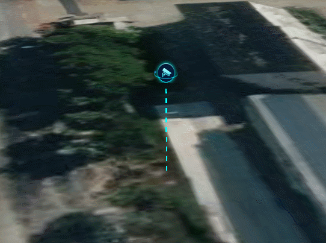

**FloatMarker类说明**
==============================
>### 功能：  
> 浮动特效点
>
  
### 接口
- 实例化
```javascript
let floatMarker = new FloatMarker(viewer,[longitude, latitude, height],style)
```
参数说明：  
>- **viewer 主视图**
>- **[longitude, latitude, height] 添加点的位置经纬度和高程**
>- **style 可选，配置点的样式(image、lineHeight、bounceHeight、increment)**
```javascript
//style的默认值
style = {
    image: "./image/float.png", //图标
    lineHeight: 8,              //线高
    bounceHeight: 0.5,          //浮动幅度
    increment: 0.008,           //增量
};
```
- 聚焦
```javascript
floatMarker.flyTo()
```
- 移除
```javascript
floatMarker.remove()
```
