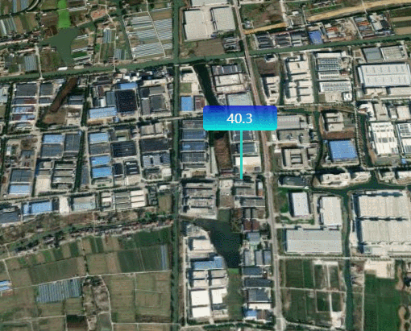

**GradientLabel类说明**
==============================
>### 功能：  
> 添加标签
>
  
### 接口
- 实例化
```javascript
let gradientLabel = new GradientLabel(viewer,[longitude, latitude, height],text)
```
参数说明：  
>- **viewer 主视图**
>- **[longitude, latitude, height] 添加点的位置经纬度和高程**
>- **text 显示文字**
- 聚焦
```javascript
gradientLabel.flyTo()
```
- 移除
```javascript
gradientLabel.remove()
```
