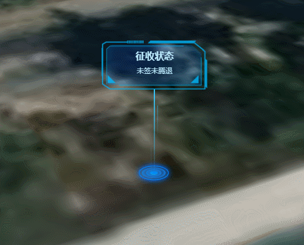

**HotSpotBoard类说明**
==============================
>### 功能：  
> 热点标签
>
  
### 接口
- 实例化
```javascript
let hotSpotBoard = new HotSpotBoard(viewer,[longitude, latitude, height], style)
```
参数说明：  
>- **viewer 主视图**
>- **[longitude, latitude, height] 添加点的位置经纬度和高程**
>- **style 可选，配置点的样式(title、content、bgImageUrl)**
```javascript
//style的默认值
style = {
    bgImageUrl: "./image/hotspotboard", //图
    title: "征收状态",              //题目
    content: "未签未腾退",          //正文
};
```
- 聚焦
```javascript
hotSpotBoard.flyTo()
```
- 移除
```javascript
hotSpotBoard.windowClose()
```