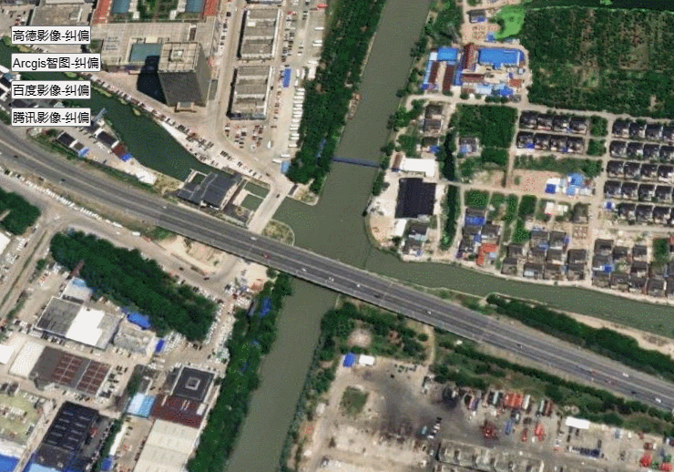
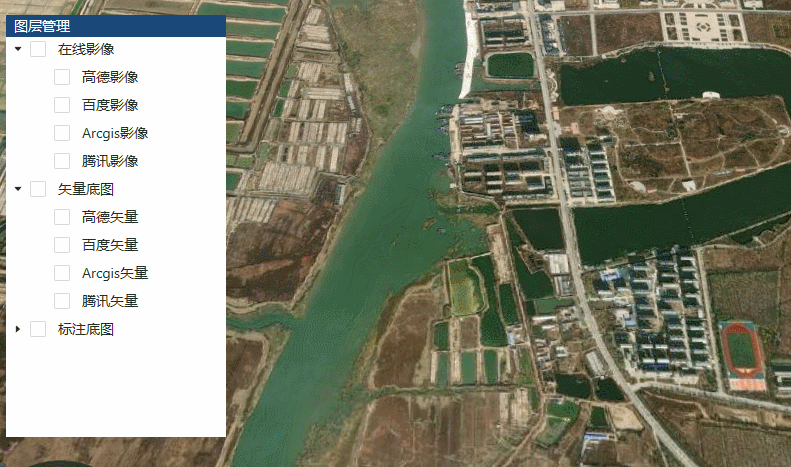

**ImageryLayer类说明**
==============================
>### 功能：  
> 纠偏各大厂商的在线影像底图   
    图中用到的底图是arcgis的在线影像
  
>   
>  
### 接口
实例化后就可以调用，并加入到球上
```javascript
let imageryLayer = new ImageryLayer()
```

- 高德地图   
>
```javascript
viewer.imageryLayers.addImageryProvider(
  new imageryLayer.AmapImageryLayerProvider(options)
);
```
参数说明 
> options 必选，配置影像 (url在线影像地址、crs坐标系)

- 百度地图   
>
```javascript
viewer.imageryLayers.addImageryProvider(
  new imageryLayer.BaiduImageryLayerProvider(options)
);
```
参数说明 
> options 必选，配置影像 (url在线影像地址、crs坐标系、style -> "normal")
- Arcgis智图   
 ```javascript
 viewer.imageryLayers.addImageryProvider(
   new imageryLayer.ArcgisImageryLayerProvider(options)
 );
 ```
参数说明 
> options 必选，配置影像 (url在线影像地址、crs坐标系)
- 腾讯地图   
 ```javascript
 viewer.imageryLayers.addImageryProvider(
   new imageryLayer.TencentImageryLayerProvider(options)
 );
 ```
 参数说明 
 > options 必选，配置影像 (url在线影像地址、crs坐标系、style -> "1")

这里提供几个在线地图

```text
1、腾讯在线
影像 https://p2.map.gtimg.com/sateTiles/{z}/{sx}/{sy}/{x}_{reverseY}.jpg?version=400
不透明矢量 https://rt3.map.gtimg.com/tile?z={z}&x={x}&y={reverseY}&styleid=1&version=297
2、百度在线
影像 http://shangetu{s}.map.bdimg.com/it/u=x={x};y={y};z={z};v=009;type=sate&fm=46
不透明矢量 http://api{s}.map.bdimg.com/customimage/tile?x={x}&y={y}&z={z}&scale=1&customid={style}
透明矢量 http://online{s}.map.bdimg.com/tile/?qt=tile&x={x}&y={y}&z={z}&styles=sl&v=020
3、高德在线
影像 http://webst02.is.autonavi.com/appmaptile?style=6&x={x}&y={y}&z={z}
不透明矢量 http://webst{s}.is.autonavi.com/appmaptile?lang=zh_cn&size=1&scl=1&style=7&x={x}&y={y}&z={z}
透明矢量   http://webst{s}.is.autonavi.com/appmaptile?lang=zh_cn&size=1&scale=1&style=8&x={x}&y={y}&z={z}
4、Arcgis在线
影像      https://services.arcgisonline.com/ArcGIS/rest/services/World_Imagery/MapServer
不透明矢量 http://map.geoq.cn/arcgis/rest/services/ChinaOnlineCommunity/MapServer
```