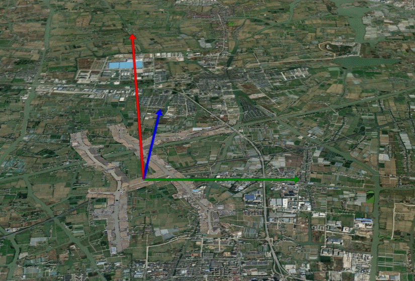
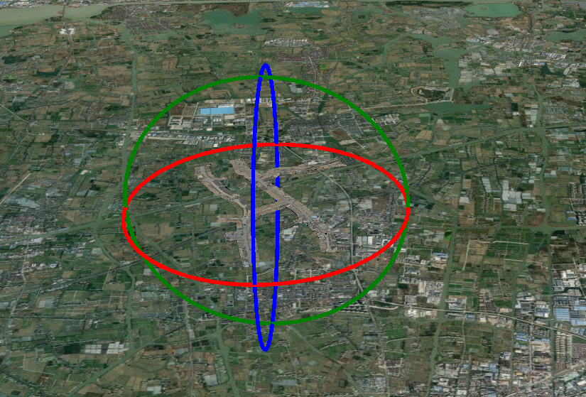

**EditB3DM类说明**
==============================
>### 功能：  
>编辑3dtiles模型，可以提供移动和旋转功能
>
  

  

### 接口
- 实例化
```javascript
let editObj = new EditB3DM(viewer, tileset, d, r);
```
参数说明：  
>- viewer 主视图
>- tileset 要操作的3dtiles模型
>- d 控制平移速度，默认为1
>- r 控制旋转速度，默认为1   

- 平移
```javascript
editObj.editTranslation()
```
- 旋转
```javascript
editObj.editRtation()
```
- 销毁/取消编辑
```javascript
editObj.destroy()
```
