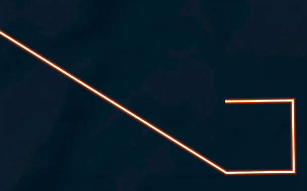

**线材质类说明**
==============================
###用法示例
```javascript
let polygonArry=[
    140.0, 20.1,78,
    140.1, 20.1,78,
    140.1, 20.0,78,
    140.0, 20.0,78,
    139.0, 20.6,78,]
viewer.entities.add({
    polyline: {
      positions: Cesium.Cartesian3.fromDegreesArrayHeights(polygonArry),//[Cesium.Cartesian3.fromDegrees(119.296389, 26.074268, 100), Cesium.Cartesian3.fromDegrees(114.171202, 22.277469, 100)],
      width: 4,
      material: material //下面的材质
    }
  });
```
>#### 一、脉冲线
```javascript
new PolylineLinkPulseMaterialProperty({
    color: Cesium.Color.CYAN, //颜色
    duration: 8000, //时间 控制速度
    url: "./image/polylinematerial/LinkPulse.png", //材质图片
})
```
  
>#### 二、流动管线
 ```javascript
new PolylineVolumeTrialMaterialProperty({
    color: Cesium.Color.RED,
    duration: 5000,
    count: 5,
    url: "./image/polylinematerial/spriteline2.png"
})
```
  
>#### 三、发光线
 ```javascript
new PolylineLightingMaterialProperty(Cesium.Color.AZURE)
```
  
>#### 四、发光线2（cesium自带）
 ```javascript
new Cesium.PolylineGlowMaterialProperty({ //设置Glow材质
    color: Cesium.Color.fromCssColorString('#FF4500'),
    glowPower: 0.2,
    opacity: 0.8,
})
```
  
>#### 五、动态材质线
 ```javascript
new PolylineEnergyTransMaterialProperty({
    color: Cesium.Color.YELLOW, //颜色
    duration: 5000, //时间
    count: 5, //重复数
    url: "./image/polylinematerial/EnergyTransLine.png", //材质图片
})
```
  
>#### 六、尾迹线材质
 ```javascript
//尾迹线
new PolylineTrailMaterialProperty({
    speed: 10 * Math.random(),
    color: Cesium.Color.CYAN,
    percent: 0.1,
    gradient: 0.3,
})
//尾迹线2
new PolylineTrialFlowMaterialProperty({
    color: Cesium.Color.RED,
    duration: 2000,
})
```
  

  
>#### 七、迁徙线材质
 ```javascript
new PolylineMigrateMaterialProperty({
    color: new Cesium.Color(1, 0.79, 0.15, 1),
    duration: 2000,
    url: "./image/polylinematerial/polylinemigrate.png"
})
```
  
>#### 八、精灵线
 ```javascript
new PolylineSpriteMaterialProperty({
    duration: 2000, //控制速度
    url: "./image/polylinematerial/spriteline1.png" //精灵线1
         //"./image/polylinematerial/spriteline2.png" //精灵线2
         //"./image/polylinematerial/spriteline3.png" //精灵线3

})
```
  

  

 
>#### 九、超级线
 ```javascript
new PolylineSuperMaterial({
    color: Cesium.Color.ORANGE,
    duration: 5000,
    count: 1,
    url: "./image/polylinematerial/flyline_01.png" //超级线
         //"./image/polylinematerial/arrow_01.png" //超级线2
})
```
  

  
>#### 十、箭头线
 ```javascript
new PolylineArrowMaterialProperty({
    color: Cesium.Color.AQUA,
    duration: 800,
    count: 3, //重复次数
    url: "./image/polylinematerial/arrowopacity.png", //材质图片"
})
```
  
>#### 十一、OD材质线
```javascript
let color = new Cesium.Color(Math.random() * 0.5 + 0.5, Math.random() * 0.8 + 0.2, 0.0, 1.0);
let primitive = new Cesium.Primitive({
    geometryInstances: new Cesium.GeometryInstance({
      geometry: new Cesium.PolylineGeometry({
        positions: Cesium.Cartesian3.fromDegreesArrayHeights(polygonArry),
        width: 2.0,
      }),
    }),
    appearance: new PolylinODPrimitiveAppearance(color)
});
viewer.scene.primitives.add(primitive);
```
  