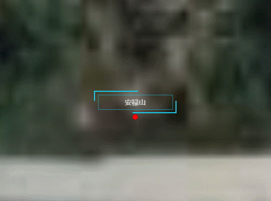

**DynamicDivLabel类说明**
==============================
>### 功能：  
> 动态div容器
>
  
### 接口
- 实例化
```javascript
let dynamicDivLabel = new DynamicDivLabel(viewer,[longitude, latitude, height],lable)
```
参数说明：  
>- **viewer 主视图**
>- **[longitude, latitude, height] 添加点的位置经纬度和高程**
>- **lable 配置div内显示的内容**

- 聚焦
```javascript
dynamicDivLabel.flyTo()
```
- 移除
```javascript
dynamicDivLabel.remove()
```