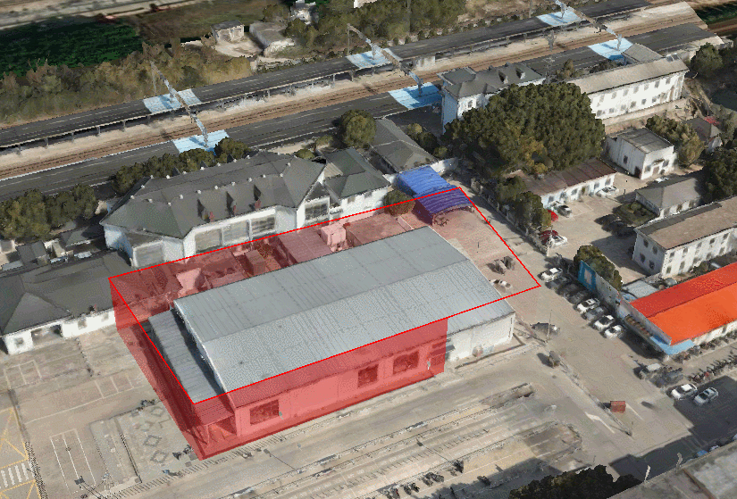

**DynamicWallMaterialProperty类说明**
==============================
>### 功能： 
>自定义材质，修改类下的着色器就可以实现不同的材质效果   
>文件夹下的color.png文件需要引入到类的DynamicWallImage中  
>效果图如下：  
  
>
>

```javascript
  let pointData = [
    120.91426004602172,30.85191152311719,
    120.91485971473507,30.852108104265113,
    120.91478769439237,30.85239592595098,
    120.91410471919966,30.85219627428252,
    120.91426004602172,30.85191152311719
  ]
  let pointHeightData = [
    120.91426004602172,30.85191152311719,25,
    120.91485971473507,30.852108104265113,25,
    120.91478769439237,30.85239592595098,25,
    120.91410471919966,30.85219627428252,25,
    120.91426004602172,30.85191152311719,25,
  ]
  viewer.entities.add({
    name : 'polyWallLine',
    wall : {
      positions : Cesium.Cartesian3.fromDegreesArray(pointData),
      maximumHeights: new Array(parseInt((pointData.length)/2)).fill(25),
      minimunHeights: new Array(parseInt((pointData.length)/2)).fill(5),
      material: new Cesium.DynamicWallMaterialProperty({
          color: new Cesium.Color(1.0, 0.0, 0.0, 0.5),
          duration: 2000,
          trailImage: imagePath
        }),
    },
    polyline : {
      positions : Cesium.Cartesian3.fromDegreesArrayHeights(pointHeightData),
      material: Cesium.Color.RED,
    }
  });
```

### 使用
>使用方法如上例所示，直接引入，然后在材质中使用即可
```javascript
import DynamicWallMaterialProperty from './dynamicWallMaterialProperty.js'
```
***
# 定义类过程中遇到问题  
- 1、在HTML中引入的Cesium和在插件中引的Cesium是不一样的，我引入的Cesium对象不是同一个，所以老是出错
- 2、引入图片需要放在public文件夹里，才能正确引入
- 3、语法错误，Cesium升级102 版本默认启用 WebGL 2.0
