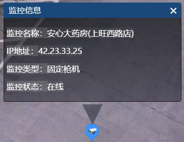
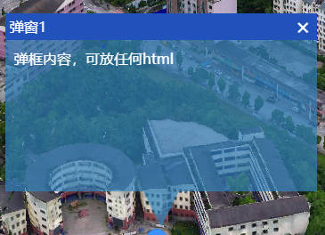
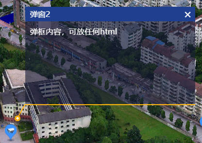
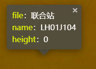
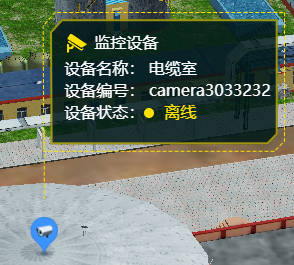

# 自定义窗口
##  **多字段自适应窗口**

```javascript
- new Map3dWindow.MultiFieldAdaptWindow(viewer,pisition,title,fields,values)
```
| 参数名称 | 参数类型          | 参数说明       |
| -------- | ----------------- | -------------- |
| viewer   | Cesium.Viewer     | 场景viewer对象 |
| position | Cesium.Cartesian3 | 坐标位置       |
| title    | String            | 窗口标题       |
| fields   | Array.<String>    | 字段列表       |
| values   | Array.<String>    | 值列表         |

##  **窗口样式1**

```javascript
- new Map3dWindow.PopupWindow1(viewer,pisition,title,html)
```
| 参数名称 | 参数类型          | 参数说明       |
| -------- | ----------------- | -------------- |
| viewer   | Cesium.Viewer     | 场景viewer对象 |
| position | Cesium.Cartesian3 | 坐标位置       |
| title    | String            | 窗口标题       |
| html     | String            | 窗口内容       |

##  **窗口样式2**

```javascript
- new Map3dWindow.PopupWindow2(viewer,pisition,title,html)
```
| 参数名称 | 参数类型          | 参数说明       |
| -------- | ----------------- | -------------- |
| viewer   | Cesium.Viewer     | 场景viewer对象 |
| position | Cesium.Cartesian3 | 坐标位置       |
| title    | String            | 窗口标题       |
| html     | String            | 窗口内容       |

##  **Leaflet风格窗口**

```javascript
- new Map3dWindow.LeafletPopup(viewer,pisition,fields,values)
```
| 参数名称 | 参数类型          | 参数说明       |
| -------- | ----------------- | -------------- |
| viewer   | Cesium.Viewer     | 场景viewer对象 |
| position | Cesium.Cartesian3 | 坐标位置       |
| fields   | Array.<String>    | 字段列表       |
| values   | Array.<String>    | 值列表         |

##  **设备信息窗口**

```javascript
- new Map3dWindow.DeviceStatusWindow(viewer,pisition,info)
```
| 参数名称 | 参数类型          | 参数说明       |
| -------- | ----------------- | -------------- |
| viewer   | Cesium.Viewer     | 场景viewer对象 |
| position | Cesium.Cartesian3 | 坐标位置       |
| info     | Object            | 如下描述       |
- info参数传入值格式应为如下形式，在线状态修改后弹窗颜色也会随之改变：
```javascript
{
    title: title,//标题
    name: name,//名称
    num: num, //编号
    status: true,//在线状态
}
```
